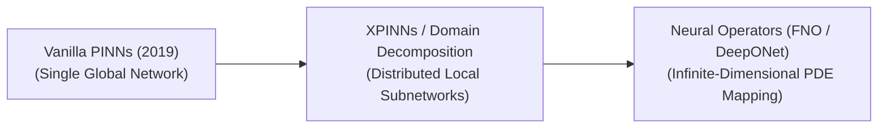

  

  
  

# 🌟 Awesome-Physics-Informed-Neural-Networks
## Physics-Informed Neural Networks (PINNs): Evolution, Variants, & Applications

Physics-Informed Neural Networks (PINNs) represent a groundbreaking convergence between deep learning and classical computational physics. Traditional neural networks act as pure data-driven black boxes, frequently violating fundamental physical constraints when data is scarce. PINNs solve this by embedding physical laws—expressed as Partial Differential Equations (PDEs)—directly into the neural network's loss function using Automatic Differentiation (AD). The network is penalized not just for failing to match data points, but for violating conservation laws, boundary conditions, or physical symmetries.

---

## 🕰️ 1. The Chronological Evolution

The architectural progression of PINNs highlights a transition from simple boundary-value solvers to highly adaptive, multi-scale, and stochastic physical simulators.

| Model Era | Concept | Year | Original Paper |
| :--- | :--- | :--- | :--- |
| [**The Vanilla PINN Era**](docs/vanilla_pinn.md) | The foundation. Parameterized a physical state using a standard Multi-Layer Perceptron (MLP). Computed exact spatial and temporal derivatives using automatic differentiation, adding the residual of the target PDE directly to the loss function. | 2019 | [Physics-informed neural networks: A deep learning framework for solving forward and inverse problems involving nonlinear partial differential equations](https://arxiv.org/abs/1711.10561) |
| [**Domain Decomposition & Parallelization (cPINNs / XPINNs)**](docs/domain_decomposition_pinn.md) | Overcame the limitation of a single network trying to learn massive, complex geometric domains. Split the physical space into distinct sub-domains, assigning a dedicated local neural network to each slice while mathematically enforcing continuity along interfaces. | 2020 | [Extended Physics-Informed Neural Networks (XPINNs): A Generalized Space-Time Domain Decomposition based Deep Learning Framework for Nonlinear Partial Differential Equations](https://arxiv.org/abs/2007.04320) |
| [**The Operator Learning Era (Modern Progression)**](docs/operator_learning_pinn.md) | Shifts from solving a single instance of a PDE to learning entire *families* of differential equations. Systems like **Fourier Neural Operators (FNO)** and **DeepONets** learn infinite-dimensional mappings between function spaces, allowing instantaneous inference for any variable boundary condition or initial state. | 2019 | [DeepONet: Learning nonlinear operators for identifying differential equations based on the universal approximation theorem of operators](https://arxiv.org/abs/1910.03193) |

---

## 📐 2. Core Mathematical & Architectural Variants

These structural variants alter how physical laws are formulated, partitioned, or calculated to improve training stability and handle multi-scale physical phenomena.

| Variant | Mechanism & Pros | Year | Original Paper |
| :--- | :--- | :--- | :--- |
| [**Variational PINNs (VPINNs)**](docs/variational_pinn.md) | *Mechanism:* Embeds the PDE using its variational (weak) mathematical form. It integrates the PDE residual against a set of localized test functions (e.g., polynomial baselines) before feeding it to the loss optimizer.   *Pros:* Drastically reduces the order of differentiation required by automatic differentiation, making it highly robust when handling non-smooth or discontinuous physical solutions (like shock waves). | 2019 | [hp-VPINNs: Variational Physics-Informed Neural Networks For Deep Learning of Partial Differential Equations](https://arxiv.org/abs/1903.00835) |
| [**Fractional PINNs (fPINNs)**](docs/fractional_pinn.md) | *Mechanism:* Extends standard calculus to fractional-order derivatives, which utilize non-local operators to model memory effects and anomalous diffusion behaviors. | 2019 | [fPINNs: Fractional Physics-Informed Neural Networks](https://arxiv.org/abs/1811.08967) |
| [**Conservative PINNs (cPINNs)**](docs/conservative_pinn.md) | *Mechanism:* Strictly enforces macro-level conservation laws (like conservation of mass, momentum, or energy) directly across sub-domain boundaries using specialized internal flux-flux optimization constraints. | 2020 | [Conservative physics-informed neural networks on discrete domains for conservation laws: Applications to forward and inverse problems](https://arxiv.org/abs/2001.05981) |
| [**Inverse-PINNs (Parameter Estimation)**](docs/inverse_pinn.md) | *Mechanism:* Operates in reverse. Instead of predicting a physical state from a known equation, it uses sparse, noisy real-world sensor measurements to backwards-solve and discover unknown physical coefficients (like fluid viscosity or material elasticity constants). | 2019 | [Physics-informed neural networks: A deep learning framework for solving forward and inverse problems involving nonlinear partial differential equations](https://arxiv.org/abs/1711.10561) |

---

## 🎲 3. Stochastic & Uncertainty Quantification Types

These advanced variations adapt PINNs to handle environmental noise, random initialization states, and unpredictable material behaviors.

| Type | Classification & Mechanism | Year | Original Paper |
| :--- | :--- | :--- | :--- |
| [**Bayesian PINNs (B-PINNs)**](docs/bayesian_pinn.md) | *Type:* Probabilistic Physics Integration.   *Mechanism:* Replaces deterministic neural network weights with probability distributions using Hamiltonian Monte Carlo or Variational Inference.   *Significance:* Quantifies both **aleatoric uncertainty** (noise in physical measurements) and **epistemic uncertainty** (lack of data or incomplete physics descriptions). | 2020 | [B-PINNs: Bayesian Physics-Informed Neural Networks for Forward and Inverse PDE Problems with Noisy Data](https://arxiv.org/abs/2003.06097) |
| [**Stochastic PINNs (SPINNs)**](docs/stochastic_pinn.md) | *Type:* Random Vector Field Solvers.   *Mechanism:* Tailored to solve Stochastic Partial Differential Equations (SPDEs) by appending a continuous Brownian motion or random noise tensor to the physical constraint layer. | 2019 | [Quantifying total uncertainty in physics-informed neural networks for solving forward and inverse stochastic problems](https://arxiv.org/abs/1903.08226) |

---

## 🏗️ 4. Real-World Engineering Applications

| Domain | Application | Year | Original Paper |
| :--- | :--- | :--- | :--- |
| [**Subsurface Fluid Dynamics & Reservoir Engineering**](docs/subsurface_fluid_dynamics_pinn.md) | Simulates oil, water, or gas migration through porous underground rock structures over decades. PINNs incorporate the Darcy Flow equations to accurately forecast reservoir depletion using highly sparse drill-hole data. | 2020 | [Physics-informed neural networks for solving forward and inverse flow problems via the Boltzmann-BGK formulation](https://arxiv.org/abs/2004.14816) |
| [**Aerodynamic Shape Optimization**](docs/aerodynamic_shape_optimization_pinn.md) | Replaces computationally expensive, multi-hour Computational Fluid Dynamics (CFD) grid simulations. PINNs embed the Naviers-Stokes equations to instantly predict airflow velocity and pressure profiles around experimental aircraft wings or vehicle chassis. | 2020 | [Surrogate modeling for fluid flows based on physics-constrained deep learning without simulation data](https://doi.org/10.1016/j.cma.2019.112732) |
| [**Biomedical Cardiovascular Modeling**](docs/biomedical_cardiovascular_modeling_pinn.md) | Models patient-specific blood flow trajectories through complex, irregular arterial blockages (aneurysms). PINNs fuse low-resolution MRI scan imagery with exact fluid mechanics equations to evaluate localized wall shear stress without requiring invasive surgical sensors. | 2020 | [Machine learning in cardiovascular flows modeling: Predicting arterial blood pressure from non-invasive 4D flow MRI data using physics-informed neural networks](https://arxiv.org/abs/1905.04362) |
