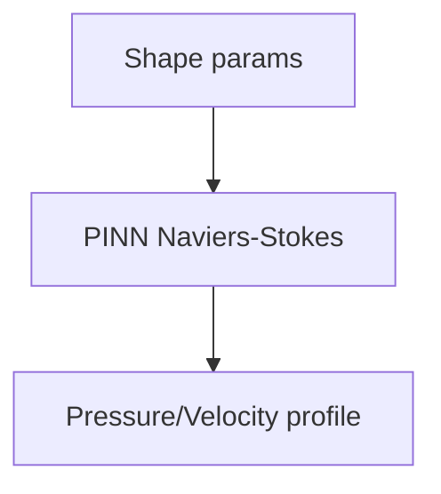

# Aerodynamic Shape Optimization

Uses Navier-Stokes embedded networks for fast CFD.

```mermaid
graph TD;
    A[Shape params] --> B[PINN Naviers-Stokes]
    B --> C[Pressure/Velocity profile]
```

[Back to README](../README.md)