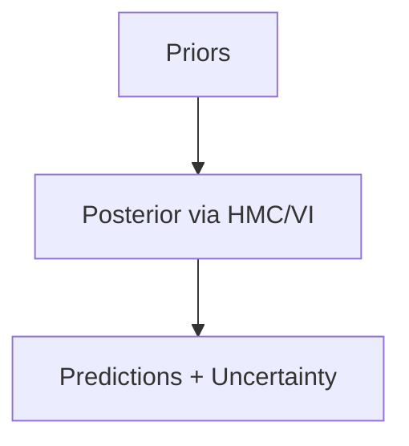

# Bayesian PINNs (B-PINNs)

Provides uncertainty quantification using Bayesian inference.

```mermaid
graph TD;
    A[Priors] --> B[Posterior via HMC/VI]
    B --> C[Predictions + Uncertainty]
```

[Back to README](../README.md)