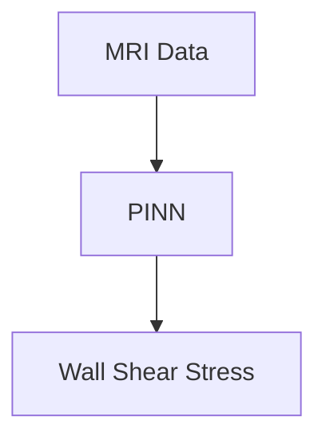

# Biomedical Cardiovascular Modeling

Models blood flow using MRI data and fluid equations.

```mermaid
graph TD;
    A[MRI Data] --> B[PINN]
    B --> C[Wall Shear Stress]
```

[Back to README](../README.md)