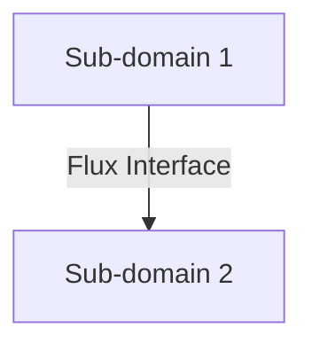

# Conservative PINNs (cPINNs)

Enforces macroscopic conservation laws across domains.

```mermaid
graph TD;
    A[Sub-domain 1] -->|Flux Interface| B[Sub-domain 2]
```

[Back to README](../README.md)