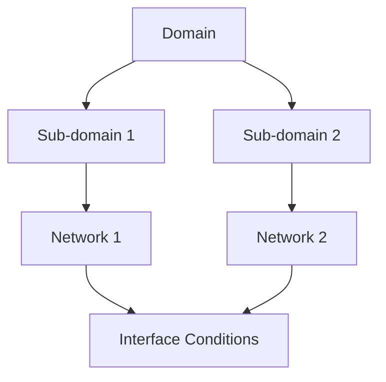

# Domain Decomposition & Parallelization (cPINNs / XPINNs)

Splits the domain into sub-domains with independent networks.

```mermaid
graph TD;
    A[Domain] --> B[Sub-domain 1]
    A --> C[Sub-domain 2]
    B --> D[Network 1]
    C --> E[Network 2]
    D --> F[Interface Conditions]
    E --> F
```

[Back to README](../README.md)