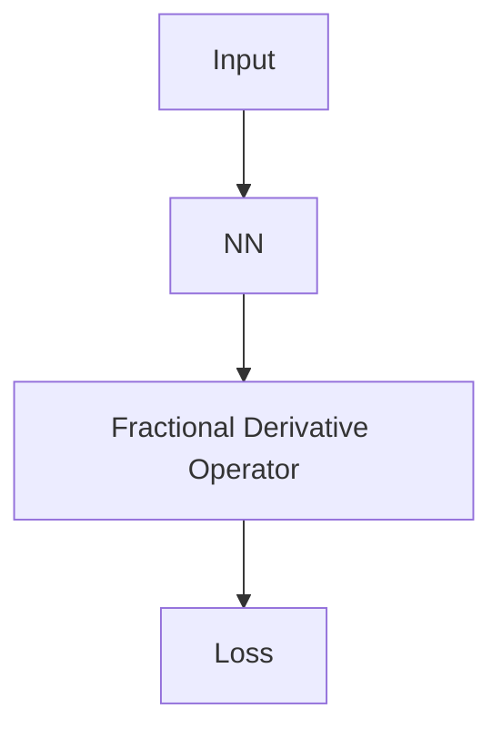

# Fractional PINNs (fPINNs)

Uses fractional calculus for non-local operators.

```mermaid
graph TD;
    A[Input] --> B[NN]
    B --> C[Fractional Derivative Operator]
    C --> D[Loss]
```

[Back to README](../README.md)