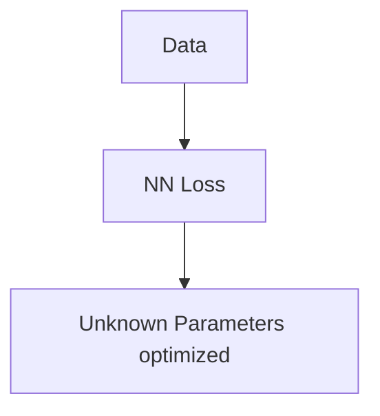

# Inverse-PINNs (Parameter Estimation)

Discovers physical parameters from sparse data.

```mermaid
graph TD;
    A[Data] --> B[NN Loss]
    B --> C[Unknown Parameters optimized]
```

[Back to README](../README.md)