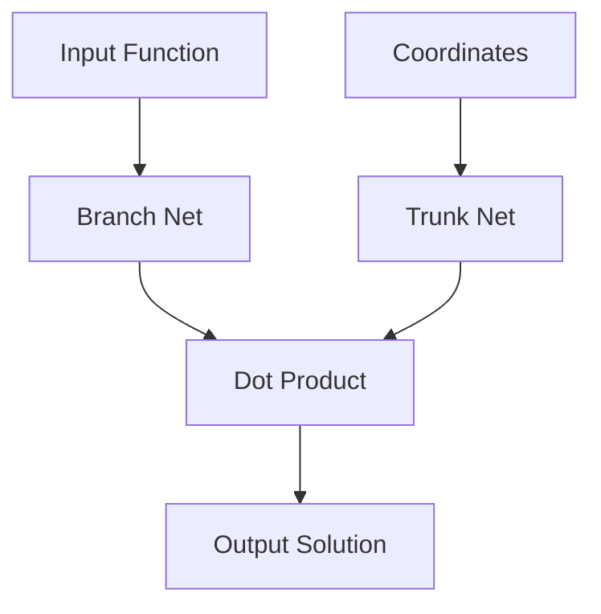

# The Operator Learning Era

Learns infinite-dimensional mappings between function spaces.

```mermaid
graph TD;
    A[Input Function] --> B[Branch Net]
    C[Coordinates] --> D[Trunk Net]
    B --> E[Dot Product]
    D --> E
    E --> F[Output Solution]
```

[Back to README](../README.md)