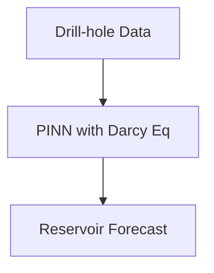

# Subsurface Fluid Dynamics & Reservoir Engineering

Applies PINNs to simulate Darcy flow in porous media.

```mermaid
graph TD;
    A[Drill-hole Data] --> B[PINN with Darcy Eq]
    B --> C[Reservoir Forecast]
```

[Back to README](../README.md)