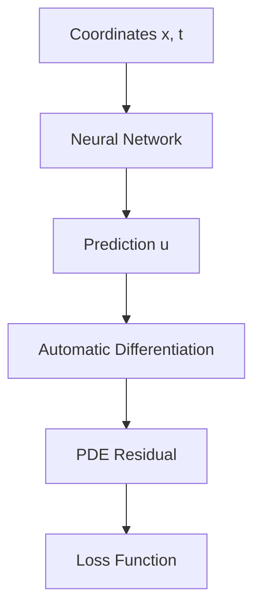

# The Vanilla PINN Era

Vanilla PINNs introduced the concept of adding the PDE residual to the loss function.

```mermaid
graph TD;
    A[Coordinates x, t] --> B[Neural Network]
    B --> C[Prediction u]
    C --> D[Automatic Differentiation]
    D --> E[PDE Residual]
    E --> F[Loss Function]
```

[Back to README](../README.md)