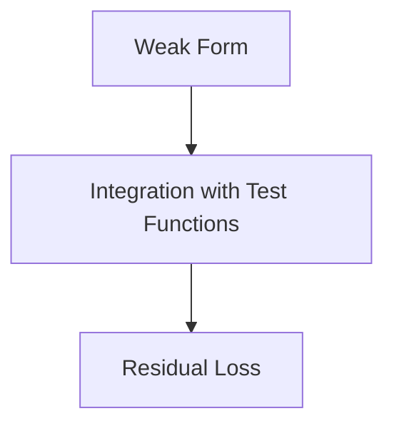

# Variational PINNs (VPINNs)

Embeds the weak formulation of PDEs to handle discontinuities.

```mermaid
graph TD;
    A[Weak Form] --> B[Integration with Test Functions]
    B --> C[Residual Loss]
```

[Back to README](../README.md)